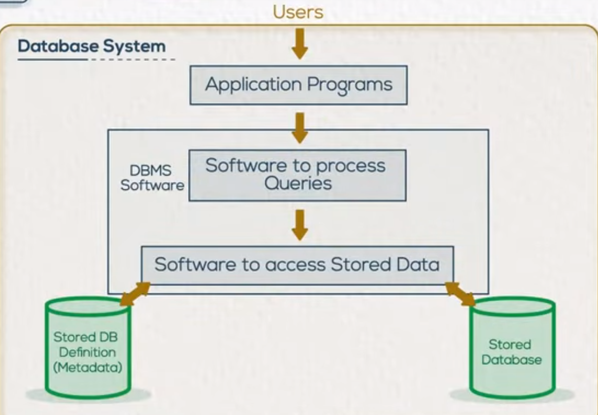

# Database Fundamentals

Content:
- [Introduction:](#intro)
    - [Database Concepts](#concepts)
    - [Database System Main Components](#components)
    - [Database Users](#users)
    - [DBMS Architecture, Data Models](#dbms)
    - [Mappings](#mappings)
    - [DBMS other functions](#other_func)
    - [Centralized Database Environment](#envs)
    - [Distributed Database Environment](#dis_envs)

- [Entity Relationship Diagram](#ERD) 
    - [Entity Relationship Modeling](#erm)
    - [Entities and Attributes](#entities&att)
    - [Relationship](#Relationship)

- [ERD Mapping to Tables](#ERD_Mapping) 
    - [Mapping strong and weak entities](#Strong_Weak_Entities)
    - [Mapping of Relationship Types](#relationship_mapping)

- [Structured Query Language](#SQL) 
    - [Database Schema & Constraints](#Schema&Constraints)
    - [SQL - Data Definition Language](#DDL)
    - [SQL - Data Control Language](#DCL)

-[Data Manipulation Language](#DML)
    - [Insert Command](#insert)
    - [Update Command](#update)

# Introduction

## Database Concepts

### Limitations of File Based Systems
- Separation and isolation of data
- Duplication of data
- Program data dependence
- Incompatible file formats

**Database:** A collection of related data.

**Database Management System (DBMS):** A software package/ system to facilitate the creation and maintenance of a computerized database.

**Database System:** The DBMS software with the data itself. Sometimes, the applications are also included. (Software + Database)

## Database System Main Components

 - Database part is divided into two parts
    - Database Definition **Metadata**: set of information about the data; Table name, columns names, columns data types, columns constraints
        
    - Stored Database: contains data itself

Database System advantages:  
- Controlling redundancy
- Restricting Unauthorized Access
- Sharing Data
- Enforcing Integrity Constraints
- Inconsistency can be avoided
- Providing Backup and Recovery

Disadvantages:  
- Needs expertise to use
- DBMS is expensive
- Some DBMS may be incompatible with others

## Database Users

Database Creation Cycle:  
1. Analysis and requirement gathering --> System Analyst
2. Database Design --> Database Designer
3. Implementation --> (DBA) Database Adminstrator
4. Application development --> Application programmer

## DBMS Architecture, Data Models

### DBMS Architecture  
DBMS consists of 3 schema architecture:
1. External Schema:  
    - More than one exists: External schema 1, External schema 2, External schema 3
    - contains data seen by all type of users
2. Conceptual Schema:  
    - schema that contains all tables and all relations between the data 
3. Physical Schema:
    - explains the allocation of the data on the disk

The three schemas are placed separately in order to achieve data independence.  
**Data independence:** the capacity of changing a schema without affecting others at a higher level.

### Data Models
1. Logical/Conceptual model: 
    - represents the conceptual schema containing the full design of the database schema
2. Physical model:
    - explains how data is stored in the disk and its access paths

## Mappings

**Mappings:** is the proccess of transforming requests and results between levels

## DBMS other functions

In the past, DBMS was able to only support Text/Numeric data.  
Nowadays, it is able to support:
- Images, Audios, Videos
- Spatial Data
- Time Series
- Data mining

## Centralized Database Environment

Centralized Database Environment went through three stages:
1. **Mainframe environment:**
    - has a mainframe (containing database server and application server) and a group of connected monitors 
    - all processing occurs on one machine (the mainframe)
    - monitors connected using a dummy terminal
    - The terminal don't make any processing, they only send requests to mainframe to be processed. After processing, data is retrieved to be viewed by end-user. 
    - Limitations:
        - slow performance
        - single point of failure for both Database and Application
        
2. **Client/Server environment:**
    - two-tier environment; Database server and Client 
    - Client: is the application set up and installed on client side. The client in this case is called thick client as the application is set up and installed locally on every end-user machine. 
    - Application layer is no longer single point of failure.
    - Limitations:
        - Database is a single point of failure. 
        - High cost for support

3. **Internet Computing environment:**
    - three-tier; Database server/storage , application server , client
    - The client in this case is called thin client as it is considered a small application accessed through a browser. This facilitates maintenance and support.
    - Limitaions:
        - Application server is a single point of failure.
        - Database server is a single point of failure.
    - The Application tier has two types:
        - If 3-tier architecture then only one application server is used.
        - For n-tier architecture multiple paralled application servers are used.

## Distributed Database Environment

There are two methods to create a database environment:
- **Relpication:**
    - Full Relpication: the full database server is copied and pasted as another server.Both operate back to back. When the main server is down, the copied server starts working and all requests are rerouted to it.  
    - Partial Relpication: Part of the database is copied and set up which is enough to serve a certain branch/location.
- **Fragmentation:** 
    - the database is divided into fragments which are either:
        - horzontal as a group of records, or
        - vertical as a group of columns, or
        - hybrid from both

Through this the single point of failure is no longer an issue. The cost is, however, increased.

------------------------
------------------------

# Entity Relationship Diagram
 

## Entity Relationship Modeling

**Entity Relationship Modeling/Diagram:** is a method used in order to make the conceptual design.  
It identifies information required by the business by displaying the relevant entities and realtionships between them.

**Entity:** any independent existence in the system which may be described using a set of characteristics or attributes.

**Guidelines for designing Entity Relationship Modeling:**
- Entities to be described in the model
- Characteristics/attributes of those entities
- Can an attribute or a set of attributes be used to uniquely identify an etity
- Relationships between entities

## Entities and Attributes

- **Entities**  -> rectangle
### Types of Attributes:
- **Single/Simple Attribute** [attributes having only one value for a particular instance.] -> oval
- **Multi-valued Attribute** [attributes having a set of values for the same particular instance] -> double line oval
- **Composite Attribute** [attributes that can be divided to subparts.] -> connected ovals
- **Derived Attribute** [attributes that can calculated/made from existing attributes.] -> dotted oval

**Weak Etities:** an entity that doesn't have a key attribute *and* is fully dependent on another entity. A double-lined rectangle is used to represent it.

## Relationship

**Relationships**: a relationship is a connection between entity classes. For a relationship, three main parameters must be known:
- Degree
- Cardinality ratio
- Participation

### Degree
- refers to the number of entites existing within the relationship.
- represented by a diamond shape
- **Types**:
    - Binary: only two entities in the relationship
    - Unary/recursive: between the entity and itself.
    - Ternary: involving three entities.
 
### Cardinality ratio
- specifies the maximum number of relationships
- one to one, many to one, one to many, many to many
- for a ternary relationship
    - 3 binary relationships are assumed and a cardinality is given to each.
    - for the same side the cardinality must be the same. If not, then the design is to be changed to a closed loop.

### Participation
- specifies the minimum number of relationships instances that each entity can participate with.
- *double lines* for **must** and *single line* for **may**

Note that an attribute may be added to a relationship. 

------------------------
------------------------
# ERD Mapping to Tables

## Mapping strong and weak entities

### Converting from Conceptual to logical design
1. Mapping regular entities
    - The attributes of an entity represent its columns
    - A primary key is set for the table. **Primary Keys:** must contain a unique value for each row of data **AND** CANNOT contain null values. If multiple attrubutes satisfy these conditions, the one with least storage is used.
    - For multi-valued attributes, a separate table is made and the primary key is used in that table as a foreign key.
    - Derived attributes aren't stored as they increase the storage taken. The only is exception is when that attribute is used frequently to retrieve the data. 
2. Mapping weak entities
    - primary key of owner entity is added as foreign key.
    - combination of the foreign key with another attribute offer a unique identification for the table.
 
## Mapping of Relationship Types

3. **One-to-many [binary/uniary]**: The primary key of the *one* entity is added as a foreign key in the *many*.
    - if the the relationship is unary then the name may differ in order to avoid confusion.
    - for weak entities where a combination of the foreign key with another attribute was used, no need to add a key as it's already there. 
4. **Many-to-many**: a new table is made having foreign keys from the main tables. Those keys form a unique combination.
5. **One-to-one**: 
    - May-May: The primary key of either could be add as foreign in the other or both could be added into a new table.
    - Must-Must: The two table are merged and either primary key could be chosen as the new primary key.
    - May-Must: The primary key of the *may* entity is added as a foreign key in the *must*.
6. **Mapping of ternary relationships**: a new table containing primary keys of entities is made. 

------------------------
------------------------

# Structured Query Language

## Database Schema & Constraints

Structured Query Language (SQL) is the language used to interact with the database.  
It is divided into 3 main categories:
- DDL [Data Definition Language]
- DML [Data Manipulation Language]
- DCL [Data Control Language]

**Database Schema:** a schema is group of related objects in a database. There is one owner of the schema who has access to manipulate the structure of any object in the schema. 

**Database Constraints:** restrictions on the database which help in maintaining the data integrity. 
- **Primary Key**
- **Not Null**
- **Unique Key**
- **Referential Integrity [FK]:** Takes into consideration dealing with foreign key (Parent/Child records) and (inserting/deleting)
- **Check:** customized to suit the column

## SQL - Data Definition Language

Responsible for the structure of the database objects.
Used for creating/editing/deleting not for data manipulation.  

**Commands:**
- CREATE
    - CREATE TABLE TABLENAME (ColumnName DataType Constraint, Column2Name DataType Constraint)
    - **Ex:** CREATE TABLE Students (StudentID NUMBER PRIMARY KEY, FirstName CHAR(50) NOT NULL, LastName CHAR(50) BirthDate DATE)
- ALTER
    - ALTER TABLE TABLENAME ADD NewColumn DataType
    - ALTER TABLE TABLENAME DROP COLUMN ColumnName
- DROP
    - *removes Whole table*
    - DROP TABLE TableName
- TRUNCATE

## SQL - Data Control Language

Commands that gives access privilege to data. Privileges can be:
- System privilege
- **Object privilege**: includes persmission given to the user for the database objects.  

**Commands:**
- GRANT
    - GRANT COMMAND ON TABLE TableName TO UserName
    - **EX:**
        - GRANT SELECT ON TABLE Table1 TO UserA *userA is only allowed to select(view) the data*
        - GRANT ALL ON TABLE Table1 TO UserB, UserC *users B and C are allowed all DMLs*
        - GRANT SELECT ON TABLE Table1 TO UserA WITH GRANT OPTIONS *userA can view the data in addition to granting the permission to others*
- REVOKE
    - REVOKE COMMAND ON TABLE TableName FROM UserName

# Data Manipulation Language

## Insert Command

- INSERT INTO TableName (Col1_name, Col2_name, Col3_name, Col4_name) VALUES ('Col1_Value_char', 'Col2_Value_char', Col3_Value_Number, 'Col4_Value_Date')  
  
**OR** if columns order is known  

- INSERT INTO TableName VALUES ('Col1_Value_char', 'Col2_Value_char', Col3_Value_Number, 'Col4_Value_Date')

**OR** if not all columns have values
  
- INSERT INTO TableName (Col1_name, Col2_name, Col4_name) VALUES ('Col1_Value_char', 'Col2_Value_char', 'Col4_Value_Date')

## Update Command
